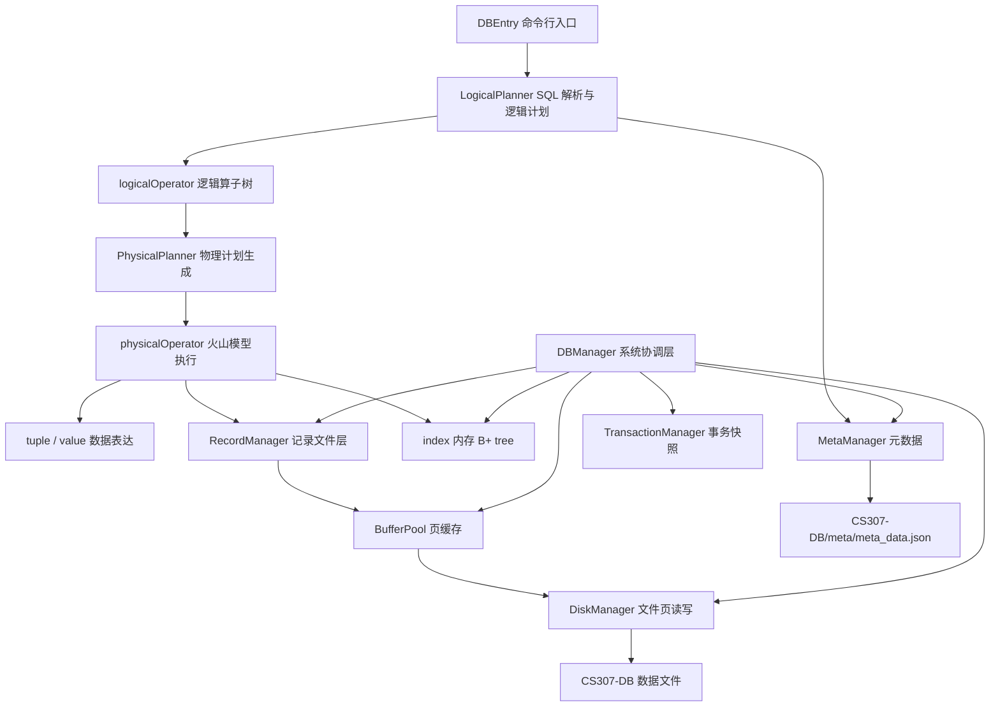

# CS307 Project2 简易数据库引擎

本项目是 CS307 Project2 的 Java 版简易数据库内核，实现了从 SQL 输入到逻辑计划、物理算子执行、记录存储、页缓存、索引和事务管理的完整链路。项目基于 Java 17 + Maven，使用 JSQLParser 解析 SQL，使用文件系统目录 `CS307-DB/` 持久化表数据和元数据。

当前已完成 PDF 中 Task 1-4 的主要要求：

- Task 1 Storage Management：LRU / Clock 页面替换。
- Task 2 Query Processing：DDL、DML、过滤、投影、聚合、排序、Join、子查询、部分 Alter Table。
- Task 3 Index：内存 B+ tree 索引、create/drop index、索引扫描、DML 同步维护索引。
- Task 4 Transaction：BEGIN、COMMIT、ROLLBACK、SAVEPOINT、ROLLBACK TO SAVEPOINT、RELEASE SAVEPOINT。

## 运行与测试

推荐用 IntelliJ IDEA 打开 `project2` 目录，等待 Maven 依赖导入后运行入口类：

```text
edu.sustech.cs307.DBEntry
```

命令行测试：

```powershell
& 'D:\IntelliJ IDEA Community Edition 2025.1.1\plugins\maven\lib\maven3\bin\mvn.cmd' -q test
```

运行前项目根目录下需要存在数据库目录：

```text
project2/
  CS307-DB/
  src/
  pom.xml
```

`CS307-DB/` 是运行期数据目录，通常不作为源码提交内容。`target/` 是 Maven 构建产物。

## 支持的 SQL 能力

表管理：

```sql
create table t(id int, name char, age int, gpa float);
show tables;
describe t;
drop table t;
alter table t add column score int;
alter table t drop column score;
explain select t.id from t where t.age >= 18;
```

数据操作：

```sql
insert into t (id, name, age, gpa) values (1, 'alice', 18, 3.6);
insert into t (id, name, age, gpa) values (2, 'bob', 19, 3.8), (3, 'carol', 20, 3.7);
update t set t.name = 'apple' where t.id = 1;
delete from t where t.age >= 20;
```

查询处理：

```sql
select * from t;
select t.id, t.name from t where t.age >= 18;
select count(*) from t where t.age >= 18;
select max(t.age), min(t.age) from t;
select t.age, count(*) from t group by t.age order by t.age;
select students.id, scores.score from students join scores on students.id = scores.id;
select students.id from students where students.id in (select scores.id from scores);
select students.id from students where exists (select scores.id from scores where scores.id = students.id);
```

索引：

```sql
create index idx_id on t(id);
select * from t where t.id = 42;
select * from t where t.id >= 10;
select * from t where t.id < 20;
drop index idx_id;
```

事务：

```sql
begin;
insert into t (id, name, age, gpa) values (4, 'd', 21, 3.4);
savepoint sp1;
update t set t.age = 22 where t.id = 4;
rollback to savepoint sp1;
commit;
```

## 总体架构



核心分层：

- `DBEntry`：负责命令行交互、初始化系统组件、输出查询结果。
- `optimizer`：把 SQL 转为逻辑算子，再转为物理算子。
- `logicalOperator`：描述 SQL 的逻辑语义，不直接访问磁盘。
- `physicalOperator`：火山模型执行器，负责逐条产出 tuple 或执行 DML。
- `system`：协调数据库运行期状态，包括元数据、记录、缓存、事务、索引。
- `storage`：页、页位置、磁盘文件、BufferPool、页面替换策略。
- `record`：定长记录文件、文件头、页头、bitmap、RID。
- `meta`：表、列、索引元数据和 JSON 持久化。
- `index`：内存 B+ tree 索引。
- `tuple` / `value`：运行时数据行、投影行、Join 行、临时结果和值类型。
- `exception`：统一异常类型。

## 查询执行流程

以 `select t.id from t where t.id = 42` 为例：

1. `DBEntry` 读取 SQL 字符串。
2. `LogicalPlanner` 使用 JSQLParser 解析 SQL。
3. 生成逻辑树：`LogicalProjectOperator -> LogicalFilterOperator -> LogicalTableScanOperator`。
4. `PhysicalPlanner` 检查 `t.id` 是否存在索引。
5. 如果存在索引，生成 `ProjectOperator -> IndexScanOperator`；否则生成 `ProjectOperator -> FilterOperator -> SeqScanOperator`。
6. 物理算子执行 `Begin / hasNext / Next / Current / Close`。
7. `IndexScanOperator` 通过 B+ tree 找到 RID，再从 `RecordFileHandle` 读取记录并构造 `TableTuple`。
8. `ProjectOperator` 输出指定列。
9. `DBEntry` 打印结果，并 flush BufferPool。

## 存储设计

磁盘数据目录：

```text
CS307-DB/
  meta/
    meta_data.json
  table_name/
    data
```

`meta_data.json` 保存表结构和索引元数据。每个表的数据保存在自己的 `data` 文件中。记录层采用定长记录，文件第一页是记录文件头，后续页是记录页。RID 使用逻辑页号和槽号定位记录。

缓存层使用 `BufferPool` 管理内存页，支持 dirty page、pin/unpin、flush 和页面替换。页面替换策略由 `PageReplacer` 接口抽象，目前实现了 LRU 和 Clock。

## 索引设计

索引本体只保存在内存中，符合 PDF 对 in-memory B+ tree 的要求；索引元数据持久化在 `meta_data.json` 中。

索引生命周期：

- `create index`：写入元数据，扫描已有表数据，构建内存 B+ tree，并打印树节点。
- `drop index`：删除元数据和运行期索引对象。
- `insert`：插入记录后，把新 RID 加入所有相关索引。
- `delete`：删除记录前读取旧值，并从相关索引删除 RID。
- `update`：比较旧值和新值，对相关索引执行删除旧 key、插入新 key。
- `rollback` / `rollback to savepoint`：恢复磁盘快照后，按元数据重新扫描表并重建索引。

索引扫描目前只对简单单列谓词启用：

- `col = value`
- `col > value`
- `col >= value`
- `col < value`
- `col <= value`

复杂 `AND` / `OR` 谓词保守使用顺序扫描，避免错误改变查询语义。

## 事务设计

事务管理使用快照方式。`BEGIN` 时保存当前数据库目录状态；`SAVEPOINT` 保存局部快照；`ROLLBACK` 或 `ROLLBACK TO SAVEPOINT` 将磁盘和元数据恢复到对应快照，并清空 BufferPool、重载 DiskManager 和 MetaManager。由于索引本体在内存中，回滚后会重新构建运行期索引，保证索引与表数据一致。

## 目录结构

```text
project2/
  pom.xml
  README.md
  我的工作说明.md
  项目结构说明.md
  tutorials/
  CS307-DB/
  src/
    main/java/edu/sustech/cs307/
    test/java/
```

## 源码文件说明

### 根包

| 文件 | 功能 |
|---|---|
| `DBEntry.java` | 命令行入口。初始化 DiskManager、BufferPool、RecordManager、MetaManager、DBManager；循环读取 SQL；调用逻辑/物理 planner；打印查询结果；退出或异常时 flush 数据。 |

### exception

| 文件 | 功能 |
|---|---|
| `DBException.java` | 项目统一数据库异常，包装 `ExceptionTypes` 并输出错误信息。 |
| `ExceptionTypes.java` | 枚举所有错误类型，并提供构造具体错误消息的静态方法，例如表不存在、列不存在、SQL 不支持、事务状态错误等。 |

### value

| 文件 | 功能 |
|---|---|
| `ValueType.java` | 定义值类型，包括 INTEGER、FLOAT、CHAR 等。 |
| `Value.java` | 运行时值对象，负责 Java 值与字节数组之间的转换，支持定长 INTEGER/FLOAT/CHAR 存储。 |
| `ValueComparer.java` | 比较两个 `Value`，用于 WHERE、排序、聚合和索引 key 比较。 |

### meta

| 文件 | 功能 |
|---|---|
| `ColumnMeta.java` | 列元数据，保存表名、列名、类型、长度和记录内偏移。 |
| `TabCol.java` | 表名 + 列名的引用对象，用于 tuple 取值、投影和表达式求值。 |
| `TableMeta.java` | 表元数据，保存列列表、列名映射和索引元数据映射；支持新增/删除列、查找列和查找列上的索引。 |
| `IndexMeta.java` | 索引元数据，保存 indexName、tableName、columnName 和索引类型 BTREE。 |
| `MetaManager.java` | 元数据管理器。负责创建/删除表、增删列、创建/删除索引，并把元数据读写到 `meta_data.json`。 |

### storage

| 文件 | 功能 |
|---|---|
| `Page.java` | 内存页对象，包含页数据、页位置、dirty 状态和默认页大小。 |
| `PagePosition.java` | 页位置标识，包含文件名和文件内偏移，用作 BufferPool 查找 key。 |
| `DiskManager.java` | 磁盘文件管理。负责创建/删除文件、读写页、分配新页、保存和重载文件偏移元数据。 |
| `BufferPool.java` | 页缓存管理。负责 FetchPage、NewPage、unpin、flush、delete all pages 和 reset，并接入页面替换器。 |

### storage/replacer

| 文件 | 功能 |
|---|---|
| `PageReplacer.java` | 页面替换策略接口，定义 Victim、Pin、Unpin、Size、Reset 等方法。 |
| `LRUReplacer.java` | LRU 页面替换器，实现最近最少使用淘汰策略。 |
| `ClockReplacer.java` | Clock 页面替换器，实现 second-chance 替换策略。 |

### record

| 文件 | 功能 |
|---|---|
| `RID.java` | 记录 ID，包含逻辑页号和槽号；实现 equals/hashCode，便于索引维护。 |
| `Record.java` | 单条记录的字节封装，支持按 offset/len 取列值字节。 |
| `BitMap.java` | 位图工具类，用于记录页中槽位占用状态的设置、清除和查找。 |
| `RecordFileHeader.java` | 记录文件头，保存记录大小、页数、每页记录数、bitmap 大小和首个空闲页。 |
| `RecordPageHeader.java` | 记录页头，保存当前页记录数和下一个空闲页号。 |
| `RecordPageHandle.java` | 记录页句柄，封装页头、bitmap 和槽位访问。 |
| `RecordFileHandle.java` | 记录文件句柄，负责插入、读取、删除、更新记录，以及逻辑页号和物理页号转换。 |

### tuple

| 文件 | 功能 |
|---|---|
| `Tuple.java` | tuple 抽象基类，定义按列取值、schema、values，并实现 WHERE 表达式和常量表达式求值。 |
| `TableTuple.java` | 表记录 tuple，从 `Record` 和 `TableMeta` 中按列解析 `Value`，并暴露 RID。 |
| `ProjectTuple.java` | 投影 tuple，只暴露 SELECT 指定的列。 |
| `JoinTuple.java` | Join 结果 tuple，组合左右两个 tuple 的 schema 和取值逻辑。 |
| `TempTuple.java` | 临时 tuple，用于 INSERT/UPDATE/DELETE 行数、聚合结果等非表记录结果。 |

### logicalOperator

| 文件 | 功能 |
|---|---|
| `LogicalOperator.java` | 逻辑算子基类，保存 children 并提供默认输出 schema。 |
| `LogicalTableScanOperator.java` | 逻辑表扫描，保存表名并校验表存在。 |
| `LogicalFilterOperator.java` | 逻辑过滤算子，保存 WHERE 条件和子算子。 |
| `LogicalProjectOperator.java` | 逻辑投影算子，解析 SELECT 列表，支持 `*`、普通列和 `count(*)`。 |
| `LogicalInsertOperator.java` | 逻辑插入算子，保存目标表、列列表和 VALUES。 |
| `LogicalUpdateOperator.java` | 逻辑更新算子，保存目标表、UpdateSet 和 WHERE 条件。 |
| `LogicalDeleteOperator.java` | 逻辑删除算子，保存目标表和 WHERE 条件。 |
| `LogicalJoinOperator.java` | 逻辑 Join 算子，保存左右输入和 ON 条件。 |
| `LogicalOrderOperator.java` | 逻辑排序算子，保存 ORDER BY 表达式。 |
| `LogicalAggregateOperator.java` | 逻辑聚合算子，保存聚合 select items 和 GROUP BY 表达式。 |
| `LogicalSubqueryFilterOperator.java` | 逻辑子查询过滤算子，用于 IN/EXISTS 等带子查询条件。 |

### logicalOperator/ddl

| 文件 | 功能 |
|---|---|
| `DMLExecutor.java` | DDL/命令执行器接口，定义 `execute()`。 |
| `CreateTableExecutor.java` | 执行 CREATE TABLE，解析列类型、长度和 offset，并调用 DBManager 创建表。 |
| `ExplainExecutor.java` | 执行 EXPLAIN，打印逻辑计划树。 |
| `ShowDatabaseExecutor.java` | 处理 JSQLParser 的 ShowStatement，目前用于兼容 show 类命令入口。 |

### optimizer

| 文件 | 功能 |
|---|---|
| `LogicalPlanner.java` | SQL 解析和逻辑计划生成。支持手写命令识别、事务命令、show/describe、create/drop table、create/drop index、select/insert/update/delete/alter/explain。 |
| `PhysicalPlanner.java` | 物理计划生成。把逻辑算子转成物理算子；为简单索引谓词选择 `IndexScanOperator`，其他情况使用 SeqScan/Filter 等原有执行路径。 |

### physicalOperator

| 文件 | 功能 |
|---|---|
| `PhysicalOperator.java` | 物理算子接口，定义火山模型方法：`Begin`、`hasNext`、`Next`、`Current`、`Close`、`outputSchema`。 |
| `SeqScanOperator.java` | 顺序扫描表记录，遍历记录页和槽位，返回 `TableTuple`。 |
| `IndexScanOperator.java` | 索引扫描。通过 B+ tree 查询 RID，再从记录文件读取记录并返回 `TableTuple`。 |
| `InMemoryIndexScanOperator.java` | 早期索引扫描骨架，目前不参与主执行路径；实际使用 `IndexScanOperator`。 |
| `FilterOperator.java` | WHERE 过滤算子，对子算子输出的 tuple 调用表达式求值。 |
| `ProjectOperator.java` | SELECT 投影算子，将输入 tuple 包装成 `ProjectTuple`。 |
| `InsertOperator.java` | INSERT 执行器，序列化 values、插入记录文件，并同步维护相关索引。 |
| `UpdateOperator.java` | UPDATE 执行器，扫描并更新满足条件的记录，同时更新相关索引。 |
| `DeleteOperator.java` | DELETE 执行器，删除满足条件的记录，同时从相关索引删除 RID。 |
| `CountOperator.java` | `count(*)` 执行器，统计子算子输出行数。 |
| `AggregateOperator.java` | 聚合执行器，支持 count、max、min 和 group by。 |
| `OrderByOperator.java` | 排序执行器，将输入物化到内存并按 ORDER BY 多列排序。 |
| `NestedLoopJoinOperator.java` | Nested Loop Join 执行器，物化右表并对左右 tuple 做 ON 条件匹配。 |
| `SubqueryFilterOperator.java` | 子查询过滤执行器，支持 IN、EXISTS 和常见相关子查询。 |

### index

| 文件 | 功能 |
|---|---|
| `Index.java` | 索引接口，定义等值查询、范围查询、插入、删除和打印树结构。 |
| `InMemoryOrderedIndex.java` | 内存 B+ tree 实现。支持节点分裂、叶子链表、重复 key 多 RID、等值/范围查询、删除 RID 和按层打印节点。 |

### system

| 文件 | 功能 |
|---|---|
| `DBManager.java` | 数据库总控类。协调元数据、记录、缓存、事务和索引；实现 create/drop table、alter table、create/drop index、索引重建、DML 索引维护和运行期状态 reload/persist。 |
| `RecordManager.java` | 记录文件管理器。负责创建/删除/打开/关闭记录文件。 |
| `TransactionManager.java` | 事务管理器。实现 begin、commit、rollback、savepoint、rollback to savepoint、release savepoint，使用目录快照恢复状态。 |

## 测试文件说明

| 文件 | 功能 |
|---|---|
| `storage/LRUReplacerTest.java` | 验证 LRU 替换器 Victim、Pin、Unpin 行为。 |
| `storage/ClockReplacerTest.java` | 验证 Clock 替换器 second-chance 行为。 |
| `storage/DiskManagerTest.java` | 验证磁盘文件创建、页读写和文件管理。 |
| `storage/BufferPoolTest.java` | 验证 BufferPool 的取页、新页、淘汰、dirty flush 等行为。 |
| `record/BitMapTest.java` | 验证 bitmap 位操作和空闲槽查找。 |
| `record/RecordFileHandleTest.java` | 验证记录插入、读取、删除、更新和 RID 语义。 |
| `meta/MetaManagerTest.java` | 验证表元数据创建、加载、保存和错误处理。 |
| `value/ValueComparerTest.java` | 验证不同 Value 类型的比较逻辑。 |
| `system/RecordManagerTest.java` | 验证 RecordManager 创建和打开记录文件。 |
| `system/Task2BasicFunctionTest.java` | 验证 Task 2 基础 DDL、投影、WHERE、COUNT、DELETE、DROP。 |
| `system/Task2AdvancedFunctionTest.java` | 验证 Join、Order By、聚合、Group By、IN、EXISTS、Alter Table。 |
| `system/Task3IndexTest.java` | 验证 create/drop index、索引扫描、范围查询、重复 key、insert/delete/update 维护索引、rollback 后重建索引。 |
| `system/TransactionManagerTest.java` | 验证事务、rollback、savepoint、release savepoint 和事务状态错误。 |

## 已知边界

- 索引为单列内存 B+ tree，不实现多列复合索引。
- 索引本体不落盘，系统重启或回滚后根据元数据和表数据重建。
- 当前索引优化只处理简单单列比较谓词；复杂布尔表达式走顺序扫描。
- Join、Order By、Aggregate 使用内存物化，适合课程项目演示，不是面向大规模数据的代价优化实现。
